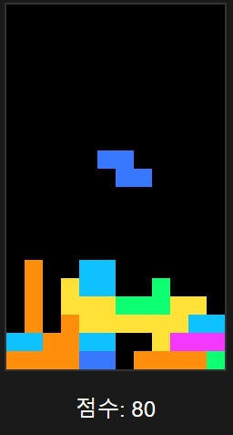

# 테트리스 게임

## 소개
클래식한 테트리스 게임을 모던한 다크 테마로 재구현한 웹 프로젝트입니다.

## 주요 기능
- 다크 테마 UI/UX
- 키보드 컨트롤
- 점수 시스템
- 레벨 시스템

## 기술 스택
- HTML5
- CSS3
- Vanilla JavaScript

## 스크린샷


## 조작 방법
| 키 | 기능 |
|---|---|
| ← | 블록 왼쪽 이동 |
| → | 블록 오른쪽 이동 |
| ↑ | 블록 회전 |
| ↓ | 블록 아래로 이동 |
| Space | 블록 즉시 떨어뜨리기 |

## 설치 및 실행

```bash
git clone https://github.com/your-username/tetris-game.git
cd tetris-game
```

## 만드는 방법을 배울 수 있는 곳

- [디자인 패턴 강의](http://ngmsoftware.com/)
- [디자인 패턴 강의](https://autopeak.co.kr/)
